#  Aegis-Oxbow: AI-Powered Privacy Relayer
**BNB Chain x YZi Labs Hackathon 2025/2026 Submission** **Track:** Privacy Solutions  


##  The 20,000+ TPS Vision
The BNB Chain 2026 Tech Roadmap targets **20,000+ TPS** and **sub-second finality**. However, standard privacy protocols (like Tornado Cash forks) process complex, gas-heavy cryptographic proofs one transaction at a time. This clogs the network, spikes gas fees, and physically prevents the chain from scaling. 

##  Why This Matters for Everyday Users
Standard crypto infrastructure is public by default and expensive to obfuscate. Aegis-Oxbow abstracts these complexities away for the normal user:

* **The "Coffee Shop" Privacy Problem:** If you buy a coffee with crypto today, the barista can view your entire transaction history and net worth. Aegis-Oxbow lets users easily fund a fresh, disconnected "spending wallet" to protect their financial privacy in everyday life.
* **The "Uber Pool" of Gas Fees:** Existing privacy tools require users to pay massive individual gas fees. By batching up to 100 intents into a single transaction, our AI Relayer splits the network fee, reducing the cost of privacy to fractions of a penny.
* **Zero Technical Knowledge Required:** Normal users don't want to manage cryptographic withdrawal notes or manually calculate gas limits. With our UI, they simply enter an amount, paste a destination address, and click "Deposit." The AI agent handles the rest.

**Aegis-Oxbow solves this at the infrastructure level.** Instead of forcing the blockchain to process 100 separate privacy transfers, Aegis-Oxbow utilizes an off-chain AI Relayer to pool user intents. It batches these intents and submits them to the network as a single **Super-Transaction**. 

By compressing blockspace usage by up to 90%, Aegis-Oxbow multiplies effective TPS and slashes individual gas costs, providing the exact middleware needed for BNB's next generation of scaling.

---

##  Key Innovations
1. **Intent-Based Batching:** Users sign an "intent" to move funds anonymously. The protocol bundles these intents, acting as an ultra-efficient "Privacy Bus" rather than 100 separate Ubers.
2. **Local AI Gas Predictor (`brain.js`):** The Relayer runs a deterministic, local neural network that analyzes block-by-block base fees. It predicts the optimal millisecond to execute the batch, securing the absolute cheapest blockspace without relying on paid external APIs.
3. **Account Abstraction (Paymaster):** The AI Relayer sponsors the gas for the final execution, ensuring the user's fresh destination wallet remains completely disconnected from the source wallet.

---

##  System Architecture

```mermaid
sequenceDiagram
    participant User as User (KYC'd Source Wallet)
    participant UI as Aegis-Oxbow Interface
    participant Vault as AegisVault (BSC Testnet)
    participant AI as Node.js AI Relayer (brain.js)
    participant Receiver as Destination Wallet (Fresh)

    User->>UI: Connects Wallet
    UI->>User: Prompts for Amount & Fresh Address
    User->>UI: Submits Privacy Intent
    UI->>Vault: User deposits BNB (Locks Funds)
    Vault-->>AI: Emits "IntentRegistered" Event
    
    rect rgb(30, 30, 30)
    Note over AI: AI Optimization Phase (Solving for 20k TPS)
    AI->>AI: Pools Intents & Analyzes Base Gas Fees
    AI->>AI: Local Neural Network predicts optimal execution block
    end
    
    AI->>Vault: Executes Batch as ONE Super-Transaction (Sponsors Gas)
    Vault->>Receiver: Distributes BNB securely to unlinked wallets
    UI->>User: Displays Anonymous Tx Receipt & Success State
```



---

##  Live Deployments & Ecosystem Fit

* **Live Application (Vercel):** `https://aegis-oxbow.vercel.app/`
* **AegisVault (BSC Testnet Verified):** `0xa8e68C396aa2daB84fcc46647842E22b0dd392b4`
* **Explorer Link:** `https://testnet.bscscan.com/address/0xa8e68C396aa2daB84fcc46647842E22b0dd392b4`
* **Golden Demo Transaction (1 Batch = Multiple Transfers):** `https://testnet.bscscan.com/tx/0xcc3129e0c7b561890d3ad03666321157e6315425c156a58b582e28e1400c52b6`

> **Note:** The AI Relayer backend is hosted on Render's Free Tier. If the Relayer Status says 'OFFLINE', please wait 30-60 seconds for the container to wake up from its sleep cycle.

---

##  Tech Stack

* **Smart Contracts:** Solidity (v0.8.20), strictly built and tested with **Foundry**.
* **Frontend:** Next.js (App Router), TailwindCSS (Brutalist Developer UI), Wagmi, RainbowKit.
* **AI Relayer Backend:** Node.js, TypeScript, Ethers.js v6, `brain.js` (Local ML).
* **Infrastructure:** Docker.

---

##  Quick Start (Local Deployment)

Aegis-Oxbow is fully Dockerized for immediate evaluation.

### Prerequisites

* Docker & Docker Compose
* Node.js v18+ (if running manually)
* Foundry (for contract testing)

### Run the Full Stack

1. **Clone the repository:**
```bash
git clone https://github.com/Ramprasad4121/Aegis-Oxbow.git
cd Aegis-Oxbow
```

2. **Environment Setup:**
Copy the example environment files and add your BSC Testnet private keys.
```bash
cp .env.example .env
```

3. **Launch via Docker:**
```bash
docker-compose up --build
```

* The Next.js frontend will be live at `http://localhost:3000`
* The AI Relayer API will be live at `http://localhost:4000`

---

##  Repository Structure

```text
/aegis-oxbow
  ├── src/
  │   ├── contracts/   # Foundry project (AegisVault.sol, scripts, tests)
  │   ├── frontend/    # Next.js application
  │   └── relayer/     # Node.js AI Agent (brain.js + Ethers listener)
  ├── docs/            # Architecture diagrams & screenshots
  ├── docker-compose.yml
  └── LICENSE          # MIT License
```

---

##  License

This project is licensed under the [MIT License](https://github.com/Ramprasad4121/Aegis-Oxbow/blob/main/LICENSE).
Built for the BNB Chain x YZi Labs 2026 Hackathon.
